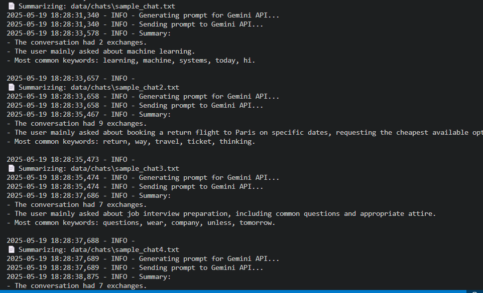
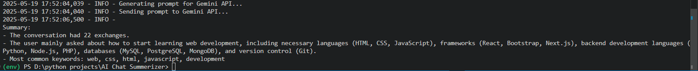

# 🧠 AI Chat Log Summarizer

This is a command-line tool that analyzes AI chat logs and generates a smart summary using the **Gemini 2.0 Flash API** by Google. It processes chat logs, extracts message statistics, identifies key topics using either **word frequency** or **TF-IDF**, and returns a concise, human-readable summary.

---

## 📂 Project Structure

```bash
chat_summarizer/
├── __init__.py               # Marks the directory as a Python package
├── analyzer.py               # Extracts message counts and keywords
├── parser.py                 # Parses chat logs
├── summarizer.py             # Builds prompt and calls Gemini API
├── utils.py                  # Logger setup and helper utilities
│
├── __pycache__/              # Compiled Python cache files (auto-generated)
│
data/
└── sample_chat.txt           # Sample input chat log
│
.env                          # Contains Google API key
.gitignore                    # Hides environment and cache files from Git
main.py                       # CLI entry point for summarization
README.md                     # Project documentation
requirements.txt              # Required Python packages
```

---

## ✅ Features

- 📊 Message statistics (user vs AI messages)
- 🔍 Keyword extraction using:
  - Word Frequency
  - TF-IDF (Term Frequency–Inverse Document Frequency)
- 🤖 Summarization using **Gemini 2.0 Flash API**
- 🧱 Modular, testable Python code
- 🔐 API key managed securely via `.env`

---

## 🚀 Getting Started

### 1. Clone the repository

```bash
git https://github.com/mdadnanshuvo/AI-Chat-Summerizer.git
cd AI-Chat-Summerizer
```

### 2. Create and activate the virtual environment

💻 On Windows

```bash
python -m venv env
env\Scripts\activate
```

💻 On macOS/Linux

```bash
python3 -m venv env
source env/bin/activate
```

### 3. Install dependencies

```bash
pip install -r requirements.txt
```

### 4. Setup your API key

Create a .env file in the root directory with your Google API key:

```bash
GOOGLE_API_KEY=your_google_api_key_here
```

## 🧪 How to Use

### Run the summarizer with a chat file:

```bash
python main.py --file data/sample_chat.txt --method tfidf
```

Arguments:

--file: Path to the .txt file containing the chat

--method: Keyword extraction method: freq (default) or tfidf


## 📷 Sample Output





## 🔧 Tech Stack

- **Python 3.10+** – Core programming language  
- **Google Generative Language API (Gemini)** – For generating natural language summaries  
- **NLTK** – Used for text tokenization and stopword removal  
- **Scikit-learn** – Utilized for TF-IDF keyword extraction  
- **python-dotenv** – Loads API key from `.env` file for secure configuration


